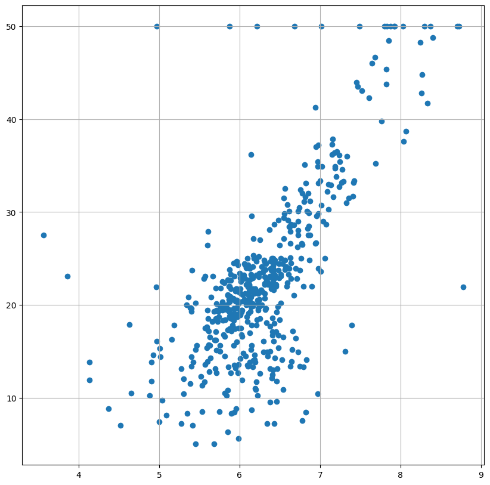
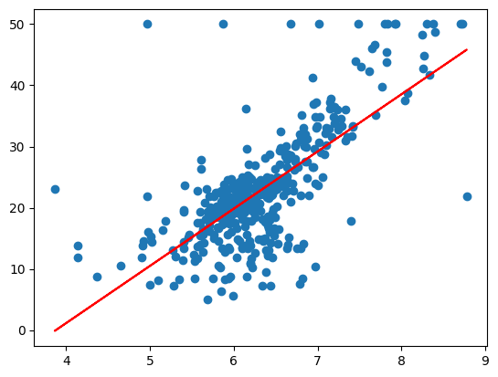
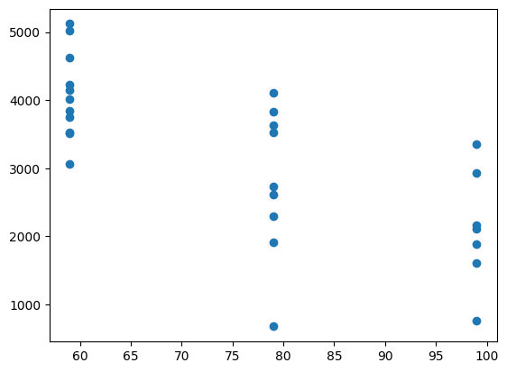
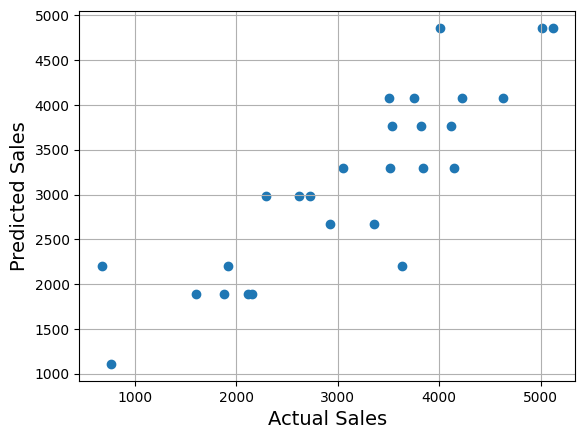

# Linear Regression Workshop Projects

This repository contains two linear regression workshop projects built to demonstrate the full machine learning workflow from data to interpretation.

## Purpose

The purpose of this work is to practice and demonstrate how a basic supervised learning model is built, trained, evaluated, and explained.

The ML problem being solved is:

- Can a simple set of input features be used to predict a target variable with linear regression?
- Can the model results be interpreted clearly enough to explain what is happening in the data?

In other words, this project is about learning how regression works in practice, not just producing a number.

The answer from the workshop examples is:

- Yes, the workflow is enough to show how linear regression can capture a basic trend
- No, the simple models are not enough to replace richer modeling or domain expertise

## What This Repository Demonstrates

- Loading a dataset and selecting features
- Training a linear regression model
- Making predictions
- Evaluating model performance with R2 and error measures
- Interpreting the output in plain language
- Visualizing the learned relationship with charts

## Projects at a Glance

| Project | What it predicts | Main result | Business readout |
| --- | --- | --- | --- |
| [Boston Housing](Boston/README.md) | Home value | Test R2: 0.371 | Room count helps explain price, but it is only a partial signal |
| [OmniPower Sales](Omnipower/Readme.md) | Sales volume | Test R2: 0.736 | Price and promotion together give a useful sales forecast |

## Boston Housing

This is a simple linear regression example using one input feature.

The model looks at whether the number of rooms in a home can help explain its value.

The pattern is positive: homes with more rooms tend to be worth more. The red line shows the average trend the model learned.

- Test R2: `0.371`
- Test RMSE: about `6.8` thousand dollars
- Plain-English takeaway: the model is directionally useful, but not precise enough to price homes on its own

[Open the full Boston summary](Boston/README.md)

## OmniPower Sales

This is a multiple linear regression example using two input features.

The model looks at how price and promotion spending affect sales.

The model found two clear business signals:

- Higher prices are linked to lower sales
- More promotion spending is linked to higher sales

- Test R2: `0.736`
- Test RMSE: about `772` sales units
- Plain-English takeaway: this is a useful planning model and it tracks sales reasonably well

[Open the full OmniPower summary](Omnipower/Readme.md)

## Notes

- The project READMEs explain the results in non-technical language.
- The charts were exported from the notebooks and saved as image files in each project folder.
- Both studies are baseline linear regression examples, so they show clear trend insights rather than perfect predictions.
